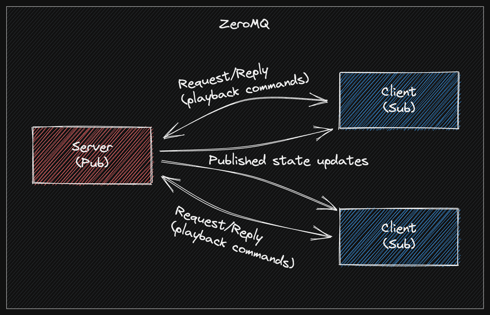

# Rasptube server
## Client
[The client can be found here](https://github.com/IgorPidik/rasptube-client)
## Communication

There are 2 communication channels (both facilitated by ZeroMQ):

* Request/Reply - Client makes requests containing playback commands (e.g. next, prev, pause, etc.) and the server executes them and sends ACK reply

* Pub/Sub - The server publishes playback state updates, keeping the clients up to date

## Run the server
`$ go run main.go`
